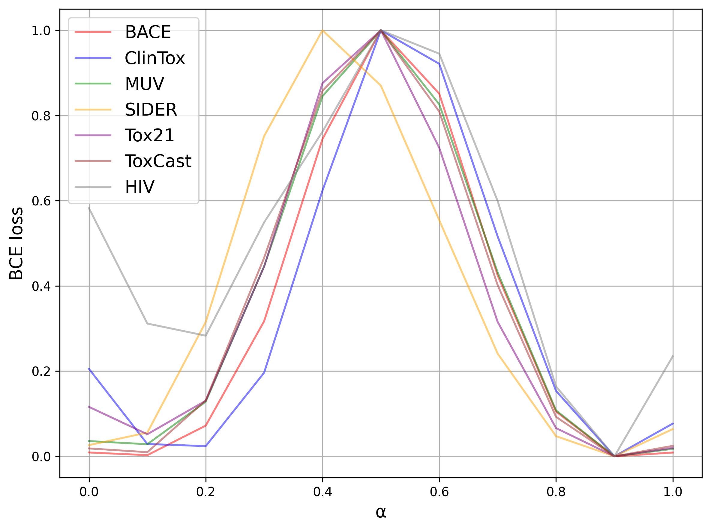
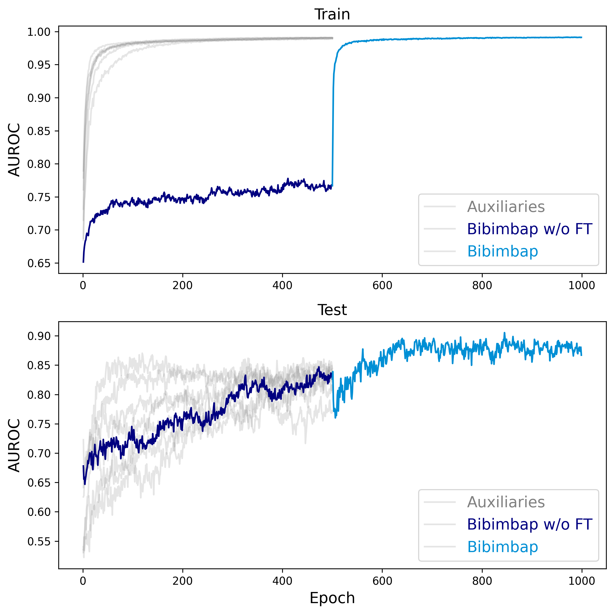

# Model Bibimbap Ensemble Framework


This is a Pytorch implementation of the following paper: 

Jinho Kang, Taero Kim, Yewon Kim, Changdae Oh, Jiyoung Jung, Rakwoo Chang, Kyungwoo Song. Bibimbap : Pre-trained models ensemble for Domain Generalization. [Pattern Recognition](https://www.sciencedirect.com/science/article/pii/S0031320324001420?dgcid=coauthor), 2024.


If you make use of the code/experiment in your work, please cite our paper (Bibtex below).

```
@article{KANG2024110391,
title = {Bibimbap : Pre-trained models ensemble for Domain Generalization},
journal = {Pattern Recognition},
volume = {151},
pages = {110391},
year = {2024},
issn = {0031-3203},
doi = {https://doi.org/10.1016/j.patcog.2024.110391},
url = {https://www.sciencedirect.com/science/article/pii/S0031320324001420},
author = {Jinho Kang and Taero Kim and Yewon Kim and Changdae Oh and Jiyoung Jung and Rakwoo Chang and Kyungwoo Song},
keywords = {Transfer learning, Molecular classification, Domain generalization, Weight averaging, Ensemble learning, Chemical dataset},
abstract = {This paper addresses a machine learning problem often challenged by differences in the distributions of training and real-world data. We propose a framework that addresses the problem of underfitting in the ensembling method using pre-trained models and improves the performance and robustness of deep learning models through ensemble diversity. For the naive weight ensembling framework, we discovered that the ensembled models could not lie in the same loss basin under extreme domain shift conditions, suggesting that a loss barrier may exist. We used a fine-tuning step after the weighted ensemble to address the underfitting problem caused by the loss barrier and stabilize the batch normalization running parameters. We also inferred through qualitative analysis that the diversity of ensemble models affects domain generalization. We validate our method on a large-scale image dataset (ImageNet-1K) and chemical molecule data, which is suitable for testing with domain shift problems due to its data-splitting method.}
}
```

## Motivation

When employing ensemble methods like our Bibimbap and [Ratatouille models](https://github.com/facebookresearch/ModelRatatouille), a key challenge is the potential inconsistency in loss landscapes across different models, leading to suboptimal ensemble performance, especially when dealing with significant domain shifts. The toy illustration (Fig. 1) and loss interpolation plot for chemical data (Fig. 2) highlight the existence of loss barriers that can arise from these mismatches and show experimentally that Mode Connectivity may not be guaranteed, highlighting the need for innovative approaches to mitigate these challenges.


**Fig. 1**: Toy illustration visualizing how an ensembled model could potentially situate itself on a loss barrier under extreme domain shifts, necessitating additional fine-tuning.



**Fig. 2**: Loss interpolation plot providing evidence of potential loss barriers between models in the chemical data domain, motivating the research to address these limitations.

## Installation
We used the following Python packages for core development. We tested on `Python 3.8.15`.
```
pytorch                   1.1.0
torch-cluster             1.6.0             
torch-geometric           2.2.0
torch-scatter             2.0.9
torch-sparse              0.6.13
torch-spline-conv         1.2.1
rdkit                     2022.9.3
tqdm                      4.62.3
tensorboardx              2.5.1
```

## Dataset download
All the necessary data files can be downloaded from the following links.

download from [chem data](http://snap.stanford.edu/gnn-pretrain/data/chem_dataset.zip) (2.5GB), unzip it, and put it under `dataset/`.

## Model Bibimbap strategy
Model Bibimbap ensembles fine-tuned models in three steps.

#### 1. Load pre-trained model and fine-tune
Under 'model_gin/', there are pre-trained models that are trained in different ways. In INPUT_MODEL_PATH, put the path to the selected model.

```
python finetune.py --input_model_file PRETRAINED_MODEL_PATH --filename OUTPUT_FILENAME --dataset DATASET --epochs EPOCHS
```

We can give as a hyperparameter whether to freeze the batch normalization layer when training the model with `--freeze_bn`.
This step creates a vanilla fine-tuned model from the pretrained model for each datasets.

#### 2. Linear probing for target dataset
```
python finetune.py --input_model_file PRETRAINED_MODEL_PATH --filename OUTPUT_FILENAME --dataset DATASET --epochs EPOCHS --freeze_gnn
```
In this step, load the pre-trained model in `PRETRAINED_MODEL_PATH` further we run linear probing on the target dataset to obtain weights to replace the linear classifier in the auxiliary model.

#### 3. Auxiliary fine-tune
```
python3 finetune.py --input_model_file FINETUNED_MODEL_PATH --replace_classifier LP_MODEL_PATH --dataset DATASET --filename OUTPUT_FILENAME --epochs EPOCHS 

```

At this stage, you can also use `--freeze_bn` to decide whether to learn or not.
Also, for ease of experimentation, we used the following form of OUTPUT_FILENAME. `target_${target}_aux_${aux}_${model_ver}`

For {target}, we wrote the name of the target dataset, for {aux}, the name of the auxiliary dataset, and {model_ver} the string such as 'fr_nfr', which summarizes whether the model was trained by running freeze_bn in the previous step and the current step.

#### 4. Ensemble and final fine-tune
```
python finetune.py --averaging_target DATASET --dataset DATASET --averaging_aux AUX_MODELS --epochs EPOCHS --model_ver MODEL_VER --ensemble_method uniform
```

`DATASET` should be target dataset, and `AUX_MODELS` should be auxiliary model's names. We added `model_ver` argument parameter for find auxiliary model's directory more easier.



**Fig. 3**: Measurement of AUROC under auxiliary fine-tuning, demonstrating the effectiveness of our approach in mitigating the identified challenges. The top plot shows the train stage, and the bottom plot shows the test stage. The transparent graphs represent the auxiliary models for the Bibimbap ensemble.

The "Bibimbap without Fine-tuning" graph initially shows a significantly lower AUROC in the train stage, indicating an underfitting state. However, after applying our proposed fine-tuning approach, both the train and test plots exhibit a considerable increase in AUROC, highlighting the model's improved performance and ability to overcome the loss barrier challenges.


At this stage, we tried a combination of `--freeze_gnn` freezing the features, `--freeze_lc` freezing the classifier, and `--freeze_bn` to find a best performing model for each dataset with hyperparameter tuning.

Furthermroe, we can select ensemble method with `--ensemble_method uniform` or `--ensemble_method dirichelt` and can select ensemble weight manualy with `ens_weight` argument.
